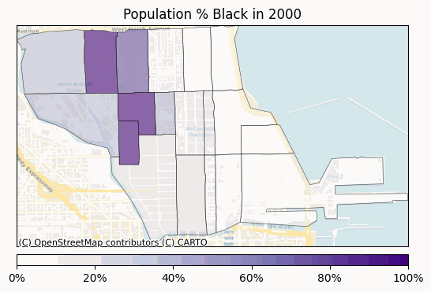

# Near North Demographics

## Overview

An investigation of the demographics of the Near North Side, inspired by reading Ben Austen's history of the Cabrini–Green Homes, [High Risers](https://www.harperacademic.com/book/9780062235077/high-risers/).

## Cabrini-Green: History

Cabrini-Green refers to the Cabrini-Green Homes, a Chicago Housing Authority (CHA) public housing project built in 1942, and the accompanying neighborhood of Cabrini-Green. Cabrini-Green, located just south of Division Street and north of Chicago Avenue, was initially predominantly white but experienced a large wave of white flight in the middle of the 20th century. Over time, the area and housing project saw a higher and higher proportion of black residents.

Poor building maintenance and neglect by the CHA led the buildings to deteriorate over time, and the area saw an increase in crime. With its notoriety for violence, and the stark juxtaposition between Cabrini-Green and the wealthy Gold Coast Area--less than a mile away--the Cabrini-Green Homes commanded local and national public attention. 

Local pressure led to the city of Chicago planning to demolish Cabrini-Green in 1996. Over the next few years, demolition took place, with the last building of Cabrini-Green being demolished in 2011. The maps in this repo try to explore the demographics of Cabrini-Green's community area--the Near North Side--in the aftermath of the demolition process.

## Cabrini-Green: Demographics

See the main Python notebook [here](main.ipynb) for my analysis. I use census data to calculate three metrics for each census tract on the Near North Side: diversity, integration, and percent of black residents as a fraction of the total population.

In the maps, I am mainly interested in the % black population, since it shows the starkest change over time. See below for an animation from 2000 to 2020.

See the Github pages website for this repo [here](https://bryantco.github.io/near-north-demographics/) for additional interactive maps of the % black population in 2000, 2010, and 2020.